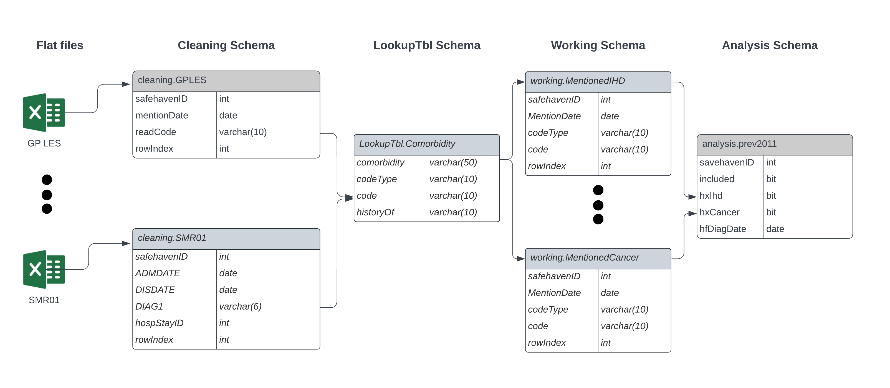

# Electronic Patient Records (EPR) Resources
A collection of resources, both papers and websites, that are useful when working with electronic patient records (EPRs), particularly Scottish data. 

Within a Scotland-specific context, NHS Scotland has a long tradition of linking and utilising health service data for research to improve patient outcomes, measure long-term outcomes in clinical trials, assess the safety of new medical interventions, and support the understanding of patterns in health and illness across whole populations. Within the context of the Scottish NHS, Data Safe Havens form an integral part of Scotland's health informatics capabilities where it is not practicable to obtain individual patient consent for participation <a href="#charterSH2015">(The Scottish Government 2015)</a>. A Safe Haven is a secure research environment supported by trained staff and information governance processes where electronic patient records (EPR) can be linked with other data and made available in a de-identified form for analysis while protecting patient identity (<a href="#sh2012">NHS Research Scotland 2012</a>, <a href="#charterSH2015">The Scottish Government 2015</a>). Safe Havens are structured such that the National Safe Haven contains information for all residents within Scotland, and four regional Safe Havens support it:
* Health Informatics Centre (HIC) - NHS Tayside with the University of Dundee
* DataLoch - NHS Lothian with the University of Edinburgh
* West of Scotland (WoS) Safe Haven - Greater Glasgow & Clyde Health Board with the University of Glasgow (recently formed from the Glasgow Safe Haven)
* Grampian Data Safe Haven (DaSH) - NHS Grampian and the University of Aberdeen

The regional Safe Havens work independently in full compliance with relevant codes of practice, legislation, and statutory orders in accordance with current professional practice. They are responsible for providing information about patients residing within their territories <a href="#charterSH2015">(The Scottish Government 2015)</a>. Together, these Safe Havens form a federated network to support research across Scotland. 

Useful link: WoS Safe Haven User Guide: https://www.nhsggc.org.uk/media/266674/glasgow-safe-haven-user-guide.pdf
  
<b>Dataset Classifications</b>
Whether it's the National Safe Haven or a regional Safe Haven, data sets available for linkage are classified into three tiers based on area coverage and data generation source. Tier 1 datasets are the most curated of the three tiers. The data are collated at a national level and contain information from everyday care, such as community-based prescriptions and hospitalisations <a href="#Watson2020">(Watson 2020)</a>. Following on, Tier 2 datasets are generated locally or regionally to help advance that location's services and to benefit their patients, such as programs to enhance general practice outcomes. Finally, Tier 3 datasets are generated by individual research projects conducted within the Safe Haven and are not currently available for request <a href="#Watson2020">(Watson 2020)</a>.

<b>Data Source Descriptions</b>

  
[!NOTE] Except for the Demographics file, records are generated based on contact with the NHS.

  The following is not an exhaustive list of available datasets, but rather, it is intended to provide a list of the most commonly requested ones. 
  Described datasets: 
    

|Datasets | Description |
| ------------- | ------------- |
| Demographics | Patient demographics |
| Deaths | Death records |
| General Practice Local Enhanced Services (GP LES) | Primary care records for specific conditions |
| Scottish Morbidity Records (SMR) | Scottish secondary care records| 
| > SMR00 | Outpatient appointments & attendance |
| > SMR01 | General/acute inpatient & day case | 
| > SMR02 | Maternity inpatient & day case | 
| > SMR04 | Mental health inpatient & day cases | 
| > SMR06 | Scottish Cancer Registry |
| Prescribing Information System (PIS) | Community-based dispensed prescriptions |
| Scottish Care Information - Diabetes Collaboration (SCI-Diabetes) | Scottish diabetes registry | 
| Scottish Care Information Store (SCI Store)| Test records |

<!--- | SERPR | Strathclyde Electronic Renal Patient Record | --->
<!--- | ChemoCare | Electronic Chemotherapy System | --->
<!--- | MUSE ECG | General Electric (GE)'s MUSE Cardiology Information System | --->
<!--- | GE Healthcare's EchoPAC | GE Healthcare's Echocardiogrpahy System | --->
<!--- | Philip's Xcelera | Philip's Echocardiogrpahy System | --->
<!--- | Athena | Glasgow's Specialist Heart Failure Registry | --->

  

<b><i>Demographics</i></b>

    Scotland has a long history of EPR captured from birth through death using individual Community Health Index (CHI) numbers. CHI numbers allow for the unique identification and tracking of patients across NHS Scotland's services <a href="#NHSDigChi2022">(NHS Digital 2022<i>a</i>)</a>. The CHI number is the Scottish equivalent to England and Wales's NHS number. CHI numbers are assigned to each patient upon first registration with the system <a href="#NHSChind">(NHS National Services Scotland nd<i>a</i>)</a>. CHI numbers are ten digits long, with the first six digits taken from the date of birth in two-digit format (<tt>DDMMYY</tt>), two random digits, a sex-based digit (i.e., even for women and odd for men), and an arithmetical check digit <a href="#NHSDigChi2022">(NHS Digital 2022<i>a</i>)</a>. 
      
    The demographic data are collated from a collection of sources based on CHI numbers. The data available within the dataset are acquired largely from National Records Scotland (NRS) and records available to the NHS Safe Haven team. Demographic data include obfuscated date of birth (DOB), sex, and Scottish Index of Multiple Deprivation (SIMD).
      
    <b>Date of Birth</b>
    The NHS Safe Haven team obfuscated the canonical DOB. In the <tt>YYYY-MM-DD</tt> date format, DOBs are uniformly obfuscated by setting the day part of the date to be the middle of the month while maintaining the month and year values. For example, a birthday of 1922-01-09 would be changed to 1922-01-15.
   
<b>Sex</b> The Demographics <tt>sex</tt> field was taken as the authoritative version for an individual's sex. 
  
<b>Scottish Index of Multiple Deprivation (SIMD)</b>
    The Scottish Index of Multiple Deprivation (SIMD) is an area-based measurement of socioeconomic deprivation assigned to residents of Scotland based on where they live. Scottish residents' SIMD 2012 status was calculated by the Scottish Government using thirty-one indicators from seven different aspects of deprivation: income, employment, health, education, housing, geographic access, and crime. The indicators are combined using a weighted sum to create a single index, providing a relative ranking for each small geographic area in Scotland. Areas average about 800 individuals <a href="#Executive2012">(The Scottish Government 2012)</a>. It is important to note that SIMD can only measure an area’s level of deprivation, not an individual’s level. The absence of deprivation should not necessarily be correlated with affluence. The terms most deprived or least deprived were used to refer to the areas and not to the individuals living in those areas <a href="#Executive2012">(The Scottish Government 2012)</a>. Indexes from other years are also available. 
  
Useful link: https://www.gov.scot/collections/scottish-index-of-multiple-deprivation-2020/
  

[!NOTE] Ethnicity is not recorded in the demographics file, though it is recorded in multiple other datasets, including the Scottish Morbidity Records and Scottish Care Information (SCI) Diabetes. Each dataset has a different level of granularity (e.g., 'White' versus 'White - Scottish' or 'White - British').

  

    

<b><i>Deaths</i></b>

      The deaths file is a Tier 1 dataset containing combined records of death from the General Register Office, sourcing data primarily from NRS deaths, though others can be used. Each record contains information including date of death (DOD), location of death, the underlying cause of death (COD), and space for up to 10 contributing <tt>COD</tt>. Since 1 January 2000, CODs are coded in accordance with the International Classification of Disease, 10th revision (ICD-10) <a href="#NRS_DeathsBackground">(National Records of Scotland 2017)</a>.
        
      <b>Cause of death</b>
      The underlying COD was recorded under <tt>COD</tt>. Within Scotland and the UK, the underlying COD is defined according to the World Health Organization's (WHO) definition as either the disease or injury which initiated the series of events leading directly to death or the circumstances of the accident or violence which produced the fatal injury (<a href="#who2022death">World Health Organization 2022<i>a</i></a>, <a href="#NationalRecordsofScotlandCOD">National Records of Scotland 2019</a>). If the certifying medical personnel cannot choose a single underlying COD, NRS uses the internationally agreed mortality coding rules in the ICD-10 standard to select the underlying cause of death <a href="#Calderwood2018CertOfDeath">(Calderwood, C. & Slater, A. 2018)</a>. Additionally, up to ten contributory CODs may be recorded. These are listed in ascending order based on their location within the series of events leading to death, with the first recorded as <tt>COD0</tt> and the last recorded under <tt>COD9</tt>.
    

      

<b><i>General Practice Local Enhanced Services (GP LES)</i></b>

       
 [!NOTE] Coverage ended in 2018. 

 Local Enhanced Services (LES) for general practice surgeries (GPs) is a service for which general practice surgeries receive additional payments for demonstrating a high-quality service for specific conditions, including coronary heart disease, diabetes mellitus, stroke, chronic obstructive pulmonary disease, heart failure with reduced ejection fraction (but not heart failure with preserved ejection fraction), learning disabilities, and nationally enhanced services for drug misuse. Surgeries can subscribe to any number of the LES, without covering every service. The GPLES dataset contains information about patients who received care under the LES scheme. Of note, coverage ended in 2018. 

Each GPLES record contains a <tt>safehavenID</tt>, the event date (<tt>EventDate</tt>), a Read code describing the entry (<tt>READCODE</tt>), a user-editable description to complement said code (<tt>Description</tt>), a flag for if the record pertains to a prescription (<tt>IsPrescription</tt>), a flag for if the record pertains to numerical values (<tt>IsValue</tt>), two value fields (<tt>Value1</tt> and <tt>Value2</tt>), the local enhanced service area (e.g., 3 for diabetes and 4 for congestive heart failure) (<tt>LESAreaID</tt>).
      

<b><i>Scottish Morbidity Records (SMR)</i></b>

Scottish Morbidity Records are Tier 1 datasets containing individual-level healthcare data for patients treated on the NHS within Scotland. The type of record denotes the general type of healthcare received and/or the patient's medical status.
  

SMR00 - Outpatient Appointments & Attendance

  [!NOTE] It is recommended to avoid using diagnostic or procedural information from SMR00
    
  SMR00 contains information on outpatient appointments, attendance, and procedures performed. A record is generated when a patient either has outpatient clinical interaction or when the patient meets with a healthcare provider responsible for care outwith an outpatient clinic session <a href="#SMR00nd">(NHS National Services Scotland nd<i>b</i>)</a>. The value of SMR00 lies in tracking patient contact with a specialist. Unfortunately, this rarely includes information on diagnosis or procedures.

SMR01 - General/Acute Inpatient & Day Case

SMR01 contains information regarding all general and acute inpatient and day cases from all NHS hospitals in Scotland. Each row of data corresponds to an episode of care. Patients receive a new episode of care each time they change specialty, significant facility <a href="#specialty">[1]</a>, or consultant for medical reasons.
     
Each episode of care contains some demographic information about the patient, admission, discharge, procedures if performed, and diagnostic factor(s) contributing to the episode. The demographic information contained within each row is limited to ethnicity, age, and Scottish Index of Multiple Deprivation (SIMD) decile and quintile. Admission information covers admission date (<tt>ADMDATE</tt>), admission type (i.e., emergency, urgent, or routine in <tt>ADMTYPE</tt>), where the patient was admitted or transferred from (<tt>ADMTRANS</tt>), what specialty the patient was treated by (<tt>SPEC</tt>), and what hospital the patient was admitted to (<tt>HOSP</tt>). Discharge information covers discharge date (<tt>DISDATE</tt>), discharge type (e.g., regular discharge, death, or transfer in <tt>DISTYPE</tt>), and where the patient was discharged or transferred to (<tt>DISTRANS</tt>). 
Each record must have the first diagnostic position (<tt>DIAG1</tt>) populated, which defines the primary diagnosis or main problem treated within the episode of care, and may have up to five additional positions populated with diagnosis information classified using ICD-10 codes. Data quality assurance assessments have suggested coding accuracy levels $\geq$ 88% using the first four digits of the ICD-10 code for <tt>DIAG1</tt>, but accuracy declines for <tt>DIAG2</tt> - <tt>DIAG6</tt>, including under-reporting of common conditions such as heart failure and atrial fibrillation/flutter (<a href="#PHS2019">Public Health Scotland 2019</a>, <a href="#Khand2005">Khand et al. 2005</a>, <a href="#DataAccuractySMR012019">National Services Scotland Information Services Division 2019</a>). However, coding may be more accurate for some conditions which have a large objective component to diagnosis (e.g., cancer, myocardial infarction), but much less accurate for those which have a large subjective component (e.g., heart failure), or where the problem is not considered a primary problem (e.g., atrial fibrillation <a href="#Khand2005">(Khand et al. 2005)</a>.
   

Additionally, each record has space for up to four procedures (<tt>OPxA</tt> [where <tt>x</tt> is the procedure number 1 - 4]) with the potential for additional information (e.g., laterality, aborted, or unsuccessful are coded in <tt>OPxB</tt> [where <tt>x</tt> is the procedure number 1 - 4]) codes recorded using Office of Population Censuses and Surveys Classification of Interventions and Procedures, version 4 (OPCS-4). Where applicable, the procedure coded in <tt>OP1A</tt> is considered the primary or main procedure for that episode of care. As with diagnostic codes, duality assurance assessments have shown coding accuracy levels $\geq$ 94% using the first four digits of the OPCS-4 code, with $\geq$ 97% of hospitals reporting codes <a href="#PHS2019">(Public Health Scotland 2019)</a>.  
  

[1] A division of medicine or density covering a specific area of clinical activity and identified within one of the Royal Colleges or Faculties.

Useful links:
* SMR01 crib sheet:https://publichealthscotland.scot/media/24925/smr01_crib_270323.pdf
* Explanation of data collection and validation: https://www.publichealthscotland.scot/publications/acute-hospital-activity-and-nhs-beds-information-quarterly/acute-hospital-activity-and-nhs-beds-information-quarterly-quarter-ending-31-december-2019/data-quality/
* WoS SMR01 Data Package explanation: https://www.nhsggc.org.uk/media/251274/13-smr01-data-package.pdf

SMR02 - Maternity Inpatient & Day Case

SMR02 collects data on all pregnancies, including maternal, pregnancy and infant characteristics. Data collection began in 1961 and has been >99% complete since the late 1970s. An SMR02 record is generated for patients receiving care in the Obstetrics Specialties/ Health Professions, including home births, both planned and unplanned. It includes maternal demographics, infant birthweight, gestational age, sex, apgar score and neonatal indicator, number of previous pregnancies, information on current pregnancy labour and delivery, and, more recently, maternal drug and alcohol use during pregnancy (and furthermore, prior to pregnancy in the case of injecting drug use). 

Useful links:
* SMR02 crib sheet: https://publichealthscotland.scot/media/24926/smr02_crib_270323.pdf

SMR04 - Mental Health Inpatient & Day Cases

  The Scottish Morbidity Records on Mental Health Inpatient and Day Cases (SMR04) contains information regarding mental health inpatient and day cases. The SMR04 dataset has a similar format to SMR01 in terms of the information provided. Data points are recorded within episodes of care and contain patient demographics, admission and discharge dates, and diagnostic information. However, in most cases, patients will be transferred to general hospitals to undergo procedures and medical intervention, which would be recorded in SMR01. For this reason, patients are still at risk of experiencing an SMR01 admission while receiving care under the purview of an SMR04 contributing facility. SMR04 admissions tend to be for more extended stays than SMR01 admissions.
    
  Useful links:
  SMR04 crib sheet: https://publichealthscotland.scot/media/24927/smr04_crib_270323.pdf

SMR06 - Scottish Cancer Registry 

  The Scottish Cancer Registry (SMR06) is maintained by Public Health Scotland and captures data on all new cancer diagnoses in Scottish residents. Each row corresponds to an individual cancer registration, with the registry dating back to 1958. From 1997, the dataset expanded to include diagnostic, staging, and treatment information.
  
  SMR06 contains patient-level data including demographics, cancer site, histology, behaviour, histological confirmation, and hospital of diagnosis. Additional variables include the Scottish Index of Multiple Deprivation (SIMD) and age at diagnosis. The registry also records the Scottish and European Network of Cancer Registries (ENCR) incidence dates, ensuring standardised definitions for follow-up and survival analyses.
  
 See Data Coding Systems below for further details on coding systems. SMR06 uses ICD-10 for disease location and ICD-O for tumour-specific information, enabling detailed analysis of cancer incidence, subtype, and outcomes. Coding captures primary malignant neoplasms, carcinoma in situ, neoplasms of uncertain behaviour, and benign tumours of the brain, spinal cord, and testis. Specific coding rules apply to bilateral tumours and haematopoietic neoplasms. Data quality is maintained through periodic updates in coding practices and classification systems.

Treatment data collection began in 1997 for all cancers and from 2000 for benign brain and spinal cord tumours. Information on staging is available from different periods onwards. Bilateral tumours are registered according to defined rules, with certain paired organs considered a single site when tumours present simultaneously with identical morphology.
The dataset is linked to hospital admissions (SMR01), death registrations, cancer waiting times, systemic anti-cancer therapy (SACT), radiotherapy, and other national datasets, facilitating comprehensive cancer intelligence analyses.

Useful links: 
* Scottish Cancer Registry Metadata:  https://webarchive.nrscotland.gov.uk/20231129165949/http://www.isdscotland.org/Health-Topics/Cancer/Scottish-Cancer-Registry/Cancer-Metadata/
* SMR06 National Data Catalogue: https://publichealthscotland.scot/resources-and-tools/health-intelligence-and-data-management/national-data-catalogue/national-datasets/search-the-datasets/scottish-cancer-registry-smr06/
* eCRUSAD - SMR06: https://ecrusad.co.uk/data-controllers-datasets/scottish-cancer-registry-smr06/

 

  
  
<b><i>Prescribing Information System (PIS)</i></b>

  The Prescribing Information System (PIS) is a reasonably unique resource that enables pharmaco-epidemiological research due to its population coverage and record linkage. PIS covers all NHS medications prescribed, dispensed and reimbursed in the community setting within Scotland <a href="#Alvarez-Madrazo2016">(Alvarez-Madrozo et al. 2016)</a>. Prescriptions written in hospitals and dispensed in the community setting are also included in the dataset <a href="#pis2022">(Information Services Division Scotland 2022<i>a</i>)</a>. Of note is that the West of Scotland version of PIS only holds records of dispensed prescriptions. PIS uses the CHI number to link individuals' prescribing and dispensing data to their other health records data since 2009, with a coverage that is almost 100% for prescribed and dispensed items <a href="#Alvarez-Madrazo2016">(Alvarez-Madrozo et al. 2016)</a>. 
    
  For each reimbursed prescription, PIS provides the approved name, product name, formulation, and strength using the British National Formulary (BNF) chapter and item codes. Importantly, PIS does not provide information on how often a medication should be taken, how many pills should be taken at one time, nor at what time of day. Additionally, records do not explicitly record the reasoning or timing of when treatment was started, changed, or terminated <a href="#williams2016making">(Williams, Brown, Peek & Buchan 2016)</a>. 
    
  <b>Use of Prescribing and Dispensing Date</b>
  Each prescription record is accompanied by a prescribing date (<tt>PRESC_DATE</tt>), indicating when the medication was prescribed to the patient, and a dispensing date (<tt>DISP_DATE</tt>), indicating when the patient acquired the medication. The PIS data has two known quirks involving the prescription and dispensing dates that need to be considered. Regarding the prescribing date, there were prescriptions for individual medications where the patient, medication, and prescribed date were the same, but each row had a different dispensed date. One would assume these are repeat prescriptions, but the pattern was rare before 2013. When this pattern isn't present, the prescribed date defaults to the dispensed date for prescriptions after the initial prescription. That is, the prescribed date changed even if the prescription was repeated.
  
Concerning the dispensing date, recorded dates likely represent when the pharmacy was reimbursed for the prescription (typically the last day of the month) rather than the date when the medication was dispensed to the patient. This record pattern is shown below, where prescription dates are uniform throughout the month, while dispensing dates tend to fall on the last day of the month. This is likely an artefact due to Scotland's free at-the-point-of-contact prescriptions, where pharmacies are reimbursed monthly rather than on the day when the patient collects the medication. 

 

    

   
   
      
<em>Spread of recorded prescription days (<tt>PRESC_DATE</tt>) across the month versus spread of recorded dispensing days (<tt>DISP_DATE</tt>), a reimbursement artefact.</em>

  Useful link: 
* Describing paper: https://academic.oup.com/ije/article/45/3/714/2572798?login=true
  

  

  
<b><i>Scottish Care Information - Diabetes Collaboration (SCI-Diabetes)</i></b>

    Scottish Care Information - Diabetes Collaboration (SCI-Diabetes) is a Tier 1 dataset holding the electronic clinical registry records pertaining to the treatment of people with diabetes mellitus in Scotland <a href="#Livingstone2012">(Livingstone et al. 2012)</a>. It holds some records dating back to the mid-1920s, but full coverage with automatic capture based on assigned Read Code started in 2000. It has a national estimated capture of $\geq$ 99% of all people diagnosed with diabetes mellitus <a href="#Livingstone2012">(Livingstone et al. 2012)</a>. 
      
    
  Useful link: 
* Describing paper: https://journals.plos.org/plosmedicine/article?id=10.1371/journal.pmed.1001321

 

  
<b><i>Scottish Care Information Store (SCI Store)</i></b>

Scottish Care Information Store (SCI Store) is a Tier 2 dataset covering the Scottish NHS Health Boards and contains clinical reports from biochemistry, haematology, pathology, microbiology, and radiology <a href="#SciStoreAbout2015">(NHS National Services Scotland 2015)</a>. The most common SCI Store linkage provided is to extract information on haematology and biochemistry test values. When using haematology and biochemistry, it is recommended to select test types using the <tt>CLINICALCODEVALUE</tt> field to capture routine tests, rather than tests taken for niche reasons.  
     
   
 Useful link: WoS data package description: https://www.nhsggc.org.uk/media/251273/07-scistore-data-package.pdf

   [!NOTE] Failed runs and impossible values are included.  Make sure to remove biologically implausible test results.

  
Specific Lab Test Information

<b>Serum Creatinine and Estimated Glomerular Filtration Rate</b> Creatinine is a waste product from muscle tissue. Normal serum levels are based predominantly on an individual's age and sex; high levels indicate impaired renal function. Serum Creatinine values are identified using the <tt>CLINICALCODEVALUE</tt> '44J3.'. It is commonly used to estimate renal function as the main component in calculating the estimated glomerular filtration rate (eGFR). It is recommended to calculate the eGFR values directly from the serum creatinine rather than using the recorded eGFR values, as these recorded values are capped at 60 ml/min/1.73m2 when values surpass this, and not all recorded serum creatinine values have mapped eGFR value.  To calculate eGFR, one must assume that the serum creatinine values were standardised using isotope dilution mass spectrometry. 
  
<b>Haemoglobin</b> Haemoglobin is a protein found in red blood cells that binds to and transports oxygen.  Its values are identified using the <tt>CLINICALCODEVALUE</tt> ‘423..’. Of note, results are recorded as either g/dL or g/L; therefore, all results must be standardised to a single unit before integrating into analyses. Additionally, there are a limited number of tests before 2010, and the values are notably different from those recorded from 2010 onwards. For these reasons, the suggestion would be to exclude values before 2010. 
 

 

<b>Data Coding Systems</b>

The following coding systems are described below:  
  
  
|Coding System| Description | Dataset(s):  |
| ------------- | ------------- |------------- |
| International Classification of Diseases, 10th revision (ICD-10) | International disease classification | Deaths, SMR00, SMR01, SMR02, SMR04, & SMR06 |
| International Classification of Diseases for Oncology (ICD-O) | Domain specific extension of ICD-10 | SMR06 | 
| Office of Population Censuses and Surveys Classification of Interventions and Procedures, version 4 (OPCS-4) | Procedural codes | SMR01 & SMR04 |
| Read Codes | Primary care coding | GP LES |
| British National Formulary (BNF)| Coding of medications | PIS |
  

<b><i>International Classification of Diseases, 10th revision (ICD-10)</i></b>

  The International Classification of Diseases (ICD) was originally a system to classify causes of death but has since expanded its scope to include non-fatal diseases, medical procedures, impairments, disabilities and handicaps <a href="#whoicd2016">(World Health Organization 2016)</a>. The 10th revision was adopted by the WHO in May 1990 and went into effect on 1 January 1993 <a href="#WhoICD2022">(World Health Organization 2022<i>b</i>)</a>. More formally, the International Statistical Classification of Diseases and Related Health Problems, 10th Revision (ICD-10) coding standard is a hierarchical standard provided by the WHO to enable systematic health recording and collection of statistics on disease in primary, secondary, tertiary care, and death certificates internationally and over time <a href="#WhoICD2022">(World Health Organization 2022<i>b</i>)</a>. The codes translate potentially complicated medical diagnoses and other health problems into a finite set of alphanumeric codes, permitting easy storage and analysis <a href="#whoicd2016">(World Health Organization 2016)</a>. 
  
 Internationally, many countries have developed country-specific modifications to the WHO's version of the ICD-10 codes <a href="#Jette2010">(Jetté et al. 2010)</a>. Universally, codes are at least three characters long, and the maximum can vary (<a href="#whoicd2016">World Health Organization 2016</a>, <a href="#Jette2010">Jetté et al. 2010</a>). Within the UK, ICD-10 codes range between 4 and 6 characters long. The first character is a letter, following international standards, and the second two characters are always numbers, then a period followed by an alphanumeric character <a href="#generalICD">(NHS National Services Scotland nd<i>c</i>)</a>. In the case of a 3-character code, the UK fills in the fourth character with an 'x' <a href="#NhsDigitalIcd2022">(NHS Digital 2022<i>b</i>)</a>. If present, the sixth character is the dagger 'D' or asterisk 'A' indicator, though these can be present in the fifth position, where there are either modified 3-character or standard 4-character codes <a href="#codeFormats">(NHS National Services Scotland nd<i>d</i>)</a>. 
      
  
Useful links: 
* More on ICD-10 and formatting in Scotland: https://publichealthscotland.scot/services/national-data-catalogue/data-dictionary/search-the-data-dictionary/icd-10-general-information/?Search=I&ID=986&Title=ICD-10%20General%20Information
* Classification browser ICD-10: https://icd.who.int/browse10/2016/en
* Code list generation: https://www.opencodelists.org/
  

<b><i>International Classification of Diseases for Oncology (ICD-O)</i></b>

For many cancer registries, diagnostic information is coded using the International Classification of Diseases (ICD) and International Classification of Diseases for Oncology (ICD-O), with version updates aligned to international guidelines. ICD-10 coding for cancers primarily captures the anatomical site of disease for clinical coding, mortality statistics, and general health reporting. In contrast, ICD-O is designed specifically for oncology, providing a dual-axis system that codes both the tumour site (topography) and detailed histological type and behaviour (morphology), essential for cancer registration and research. 

Useful links:
* NIH's National Institute of Cancer's ICD-O-3 coding materials: https://seer.cancer.gov/icd-o-3/
* The WHO's classification reference: https://iris.who.int/bitstream/10665/96612/1/9789241548496_eng.pdf

<b><i>Office of Population Censuses and Surveys Classification of Interventions and Procedures, version 4 (OPCS-4)</i></b>

  The Office of Population Censuses and Surveys Classification of Interventions and Procedures, version 4 (OPCS-4) coding standard is developed, maintained, licensed, and supported by NHS Digital's Terminology and Classifications Delivery Service and governed by Crown Copyright <a href="#opcsNHSDigital2019">(NHS Digital 2019)</a>. OPCS-4 is a hierarchical coding standard used to classify operations, procedures, and interventions conducted within the NHS. OPCS-4 codes are four characters long and have a similar structure to ICD-10 codes. OPCS-4 codes start with a letter followed by three digits. A full stop (.) separates the second and third digit <a href="#opcs2021">(NHS Digital 2021)</a>. 
    
  
Useful link: Classification browser OPCS-4.10: https://classbrowser.nhs.uk/#/book/OPCS-4.10
  

<b><i>Read Codes</i></b>

Read Codes are a hierarchical controlled clinical vocabulary for terms and short phrases (<a href="#Robinson1997">Robinson et al. 1997</a>, <a href="#Pringle1990">Pringle 1990</a>, <a href="#Chisholm1990">Chisholm 1990</a>). The first widely used version of Read Codes was standardised to 4-byte set codes, which was then extended to a 5-byte unified set. Version 2 added a term code to hold an <tt>idea</tt> or <tt>concept</tt>, where the preferred term appends '00' and additional synonyms append term codes 11-99  <a href="#Booth1994">(Booth 1994)</a>. For example, if the original 5-byte Read Code was 'G30..' for acute myocardial infarction, the 5-byte version 2 code, with the preferred term code, is 'G30..00' for 'Acute myocardial infarction' and the first synonym, 'Attack - heart' for heart attack, is 'G30..11', followed by 'Coronary thrombosis', 'G30..12'. 
The WoS's GP LES dataset uses the 5-byte set of codes without the term code, which means synonyms are mapped onto the same five-digit code. For example, 'G580.00', 'Congestive heart failure', and 'G580.11', 'Congestive cardiac failure' both map onto 'G580.'. Additionally, trailing space holders (.) have been removed due to formatting errors or deliberate elimination. This means 'G580.11' maps to 'G580' and 'G58..00', and 'heart failure' maps to 'G58'. 
    

  Useful links: 
  * Code lists (published, but use with care): https://clinicalcodes.rss.mhs.man.ac.uk/
  * HDRUK Phenotype Library (published, but used with care): https://phenotypes.healthdatagateway.org/
  * Read Code to SNOMED CT maps, it helpfully separates the v2 Read Code from the term code: https://nhsengland.kahootz.com/t_c_home/viewDatastore?datviewmode=list&nexturl=&sortdir1=asc&showsingleitem=N&sourcedsid=&dsid=407588&objectid=407588&exp=e1&showallcolumns=N&sortcol1=col_0&ajaxmode=&sortcol2=&cardcolno=&sort=&shownum=10&sortdir3=&sortcol3=&sortdir2=&showadvancedsearch=N&adv=&rowid=&action=&sel=&search=g58&btn_search=

<b><i>British National Formulary (BNF)</i></b>

The first nine characters of the BNF code specify the chemical level of the medication. Within these nine characters, the first two characters indicate the chapter of the BNF from which the medication is taken. For example, drugs in BNF Chapter 2 (Cardiovascular System) will always begin with '02'. The code is then further subdivided into sections (e.g., Diuretics, contained within Chapter 2 Section 2 of the BNF, all begin with '0202'). The remaining six characters provide more detailed information about the medication, including whether the product is branded or generic, its strength, and its formulation (see below for a breakdown of a 9-character BNF code).
  

  
  
  <em>A breakdown of the BNF code for a generic 40 mg tablet of furosemide. 'AA' in the 'Product' section always indicates that the medication is a generic version. The asterisk indicates that any code could be entered in this section.</em>

  
<b>Classifying Prescriptions</b>
There are two primary ways to classify prescriptions. The first and most straightforward way is to classify prescriptions using the BNF Chapter, Section, or Paragraph. The benefit of this classification mechanism is that it easily groups medications without incorporating potential selection bias or classification errors. However, combination medications are often in a separate paragraph from the constituent chemicals. 
  

The alternative is to classify medications based on their active chemicals, meaning that loop diuretics would include all medications which include a member of the loop diuretic family:
  

|BNF Code  | Description |
| ------------- | ------------- |
| 020202 | Loop diuretics (the Paragraph) |
| 0202040D0 | Amiloride HCI with loop diuretics |
| 0202040B0 | Co-amilofruse (Amiloride hydrochloride/frusemide) |
| 0202040T0 | Spironolactone with loop diuretics | 
| 0202040U0 | Triamterene with loop diuretics | 
| 0202080D0 | Bumetanide/Amiloride hydrochloride |
| 0202080C0 | Bumetanide/potassium | 
| 0202080K0 | Furosemide/potassium |

  

Useful links: 
* Open Prescribing: https://openprescribing.net/bnf/
* Code list generation: https://www.opencodelists.org/
* BNF code descriptions: https://www.bennett.ox.ac.uk/blog/2017/04/prescribing-data-bnf-codes/#:~:text=The%20BNF%20codes%20from%20this,BNF%20a%20drug%20is%20from.

  

<b>General Tips</b>

The following includes some general information for visualising how the flat files fit together and tips for harmonising data into coherent variables. 

<b><i>Data Cleaning and Preparation</i></b>

The data provided by the different safe havens are classified as 'real-world' data, and the files provided require formatting, preparation and cleaning based on the research question. These steps are an iterative and time-intensive process of exploration and experimentation <a href="#Lohr2014">(Lohr 2014)</a>. In particular, data cleaning is where the raw data are checked for accuracy, consistency, and completeness. This includes scrutiny of the raw data for outright errors and correction of errors where possible <a href="#rothman2021">(Rothman et al. 2021)</a>. 
  
In conjunction with data cleaning, the creation of a research-quality dataset entails refining which data are used and how they are structured in order to facilitate answering the research question(s) <a href="#Leek2019">(Leek 2019)</a>. Particular attention must be paid to the required data format by downstream tools, level of required data granularity, ease of manipulation and use, validity and accuracy underlying the data collection, and documentation of potential biases <a href="#Leek2019">(Leek 2019)</a>. This process occurs in tandem with combining the relevant and required data points needed to answer said question(s).
  
Relational databases, statistical software, and potentially a scripting language (e.g., Python) are the main tools often used for data cleaning and preparation.    
  

Relational Databses

Relational databases are a convenient way to order, structure, and subset raw EPR into 'research-ready' tables for statistical analysis. The EPR data available to researchers come in comma-separated value (CSV) files. Each file contains information from a separate data source (i.e., death records, community-based prescriptions, laboratory records, hospital admissions). When moving from raw data to research-ready tables, I tend to organise databases and tables using schemas, which are used to communicate the architecture of the database.  
  
  

  
  
  <em>An illustration of how the schemas are structured and interlinked to create research-ready tables.</em>

To this aim, schemas are structured from the raw data to analysis-ready in the order of <tt>staging</tt>, <tt>lookupTbl</tt>, <tt>cleaning</tt>, <tt>working</tt>, and <tt>analysis</tt>. Drop the <tt>staging</tt> schema if working directly from flat files. As an overview, the tables in <tt>staging</tt> hold the data as it arrives as the flat files provided by Safe Haven.  These tables assume that all columns contain varchars (or characters), a variable length series of numbers, letters, or characters, to limit forced or incorrect data conversion errors. The <tt>lookupTbl</tt> schema holds lookup tables that define various disease definitions, drug classifications, or measurement groupings. The <tt>cleaning</tt> schema refers to the cleaned data imported and cleaned from the <tt>staging</tt> schema. The tables in <tt>working</tt> are long-format tables containing information about a given test, disease, or medical history. Finally, the <tt>analysis</tt> schema tables hold data developed and formatted for input into a statistical software program for analysis. Going into detail per schema: in the <tt>cleaning</tt> schema, columns that have been correctly formatted (e.g. numeric values are now numeric and not strings, bit columns are now bits and not varchars, etc.). Unique row indexes (<tt>rowIndex</tt>) have been added to all tables, which remain with the record through inclusion into <tt>working</tt> tables. Row indexes are unique within each table but are reused between tables. Finally, columns have been added that apply to all values in each table. In cases where an event date and event time are stored in one column, these were split into separate date and time columns. Many of the tables will have an <tt>included</tt> column added, which indicates that a record should be excluded from future analysis for various reasons (e.g., impossible dates, null values, or numeric overflow errors) where 0.
  
Tables within the <tt>working</tt> schema hold all records pertaining to its particular condition or measurement. To create these tables, records from the cleaning schema are parsed into long-format tables with the help of the lookup tables in the <tt>lookupTbl</tt> schema. Tables that begin with ‘Mentioned’ hold all coded references to that disease. Tables in the working schema that do not start with ‘Mentioned’ hold all lab records for the named test or measurement. For example, the <tt>working.MentionedIHD</tt> table holds all coded references of ischaemic heart disease while <tt>working.Haemoglobin</tt> holds all haemoglobin test records, regardless of anaemia status.
  
The <tt>analysis</tt> schema holds tables that are ready to be imported into the statistical software for analysis and visualisation.

Scripting and Statistical Languages

Python is the most common scripting language used within the trusted research environment.  Of note, Python is typically used within Spyder or Jupyter Notebooks without access to a command line for governance reasons. 
  
R, STATA, and SAS are the most commonly used statistical languages. 

<b><i>Deriving Useful Variables</i></b>

  The following derivations were used for the analysis contained within <a href="#Friday2024">'Loop diuretic therapy with or without heart failure: impact on prognosis' by Friday et al.</a>

Defining Hospital Admissions

The length and number of hospital admissions both reflect the severity of the disease and the resources expended. Unique hospital admissions should be identified and grouped from the recorded episodes of care in both SMR01 and SMR04.
  
According to National Services Scotland, a continuous inpatient stay is defined as an unbroken period of time that a patient spends admitted in hospital <a href="#Redpath2018">(Redpath 2018)</a>. Taking into account the example provided in Redpath’s report and the lack of information on the time of day for discharges and re-admissions, a single hospital admission can be defined as the set of all episodes of care that differed by no more than one calendar day between one episode’s discharge and the subsequent episode’s admission date as shown by the green arrow in the figure below. This holds whether or not patients transferred between hospitals or NHS boards <a href="#Anwar2011">(Anwar et al. 2011)</a>. This is particularly important as many cardiac patients are transferred to and from the Golden Jubilee National Hospital for specialist care. If two episodes of care differ by at least one day, these two episodes are considered to belong to different hospital stays, and the event is classified as a new
admission (see the blue arrow below). Hospital admissions were identified and labelled with unique identification numbers, <tt>hospStayID</tt>, within SMR01 and SMR04. 
  

  
  
  <em>A synthetic example of admission and discharge information contained in the Scottish Morbidity Records General/Acute Inpatient and Day Case (SMR01) episodes of care. Episodes of care are considered part of the same hospital stay if the difference between an admission and discharge dates was at most one day (green arrow), regardless of the hospital; otherwise, the records were considered from two different admissions (blue arrow). This allows for a transfer at 11:30 p.m. with an arrival after midnight to be registered as the same admission.</em>

The length of hospital admission is usually defined as the difference between the first admission date and the last discharge date for each hospStayID. This value is recorded in the <tt>lenOfStay</tt>
field. It is important to check the <tt>lenOfStay</tt>, as it is possible to get extremely long stays (> 5 years).  Depending on the project, excluding these patients is advisable; such a length of stay in an acute hospital is improbable, and if true, they would not have received any community-dispensed prescriptions, making pharmacoepidemiological analysis difficult.

Identifying First Record of Stay

  
For hospital admissions spanning more than one episode of care (see above for the definition of continuous hospital admission), hospital episodes need to be ordered within an admission in order to identify the admission reason. The pragmatic approach to doing this was to rank episodes of care  to prioritise earliest dates, most urgent admission reason, and transfer to other institutions over discharges home or death to find the most probable first episode of care. 
This can be done using the following logic:
  1. Prefer the earliest admission date (rank <tt>ADMDATE</tt> in ascending order).
  2. Prefer an admission/transfer from a private residence before admission from an institution or a transfer within the same health board/health care provider (rank <tt>ADMTRANS</tt> in ascending order).
  3. Prefer emergency admissions over urgent or routine admissions (rank <tt>ADMTYPE</tt> in descending order).
  4. Prefer a discharge/transfer to another health board/ health care provider before an institution, private residence, or finally death (rank <tt>DISTRANS</tt> in descending order).
  5. Prefer the earliest discharge date (rank <tt>DISDATE</tt> in ascending order).
  6. Prefer missing admission reasons, as it is the most common, followed by an acute admission with no additional detail added, then admission for treatment, pre-operative preparation, and so on, finishing with geriatric palliative care (rank <tt>ADMREAS</tt> in ascending order).

Using the above logic, the reference admission flag (<tt>refAdmit</tt>) is set to 1 for the highest-ranked episode of care, while the other episodes are given a 0 flag.

Defining Ethnicity Variable

As mentioned in the Demographics section above, ethnicity is not included in the Demographics file. Instead, researchers need an algorithm to define it.  

Ethnicity was recorded in multiple datasets, including the SMRs and SCI Diabetes. Each dataset has a different level of granularity (e.g., 'White' versus 'White - Scottish' or 'White - British'). To provide a level of standardisation across datasets, researchers tend to classify a patient's ethnicity as White, Black, Asian, Other, or Missing. Implement the following steps to define patient ethnicity as follows:
1. Gather all references to patient ethnicity from the database, including the event date (i.e., <tt>ADMDATE</tt> or <tt>DATE</tt>) and <tt>safehavenID</tt>.
2. Group ethnicity into Asian, Black, other, White, and missing (see table below for the list of codes)
3. Assign the most recently recorded ethnicity group 'other' where the ethnicity is known.
4. Assign all patients with no record of ethnicity as 'ethnicity missing'.
     
   

 <em>Examples of ethnicity classifications to group the ethnicity values recorded across the various data sources.</em>
 
|Ethnicity Classification | Recorded Ethnicity |
|---|---|
|Asian| 
 'Any other Asian background' 
 'Arab' 
 'Arab, Arab Scottish or Arab British'
 'Bangladeshi' 
 'Bangladeshi, Bangladeshi Scottish or Bangladeshi British'
'Chinese' 
 'Chinese, Chinese Scottish Chinese British'
 'Indian' 
 'Indian, Indian Scottish or Indian British'
 'Other - Asian, Asian Scottish or Asian British'
 'Other Asian, Asian Scottish or Asian British'
 'Pakistani'
 'Pakistani, Pakistani Scottish or Pakistani British'|
|Black| 
 'African' 
 'African, African Scottish or African British' 
 'Any other Black background' 
'Black African'
'Black, Black Scottish or Black British'
 'Black Other'
 'Caribbean'
 'Caribbean, Caribbean Scottish or Caribbean British'
 'Other African'
 'Other - African, Caribbean or Black'
 'Other African, Caribbean or Black' 
  'Other Caribbean or Black' |
|White| 
 'Any Other White background'
 'Any other white ethnic group' 
 'British' 
 'English'
 'Irish' 
 'Northern Irish'
 'Welsh' 
 'White' 
 'White - British' 
 'White - English'
 'White - Gypsy/Traveller' 
 'White - Irish' 
 'White - Northern Irish'
 'White - Other British'
'White - Other white ethnic group'
 'White - Polish' 
 'White - Scottish'
 'White - Welsh'|
|Other|
 'Any mixed or multiple ethnic groups'
 'Any other ethnic background'
 'Other - Other ethnic group' 
 'Other ethnic group'
 'Other Ethnic group - Other'|
|Missing| 
 NULL 
 'Not Known' 
 'Refused' item 
 'Refused/ Not provided by patient' | 

<b>References</b>

The contents of this page have been adapted and extended from my PhD thesis: 
Friday, J. M. 2023. The pharmaco-epidemiology of loop diuretic dispensing and its relationship to the diagnosis of heart failure and to prognosis. PhD, University of Glasgow. 
  

 Alvarez-Madrazo, S., McTaggart, S., Nangle, C., Nicholson, E. & Bennie, M. (2016), ‘Data resource profile: The Scottish National Prescribing Information System (PIS)’, International Journal of Epidemiology 45(3), 714–715f. URL: https://doi.org/10.1093/ije/dyw060

Anwar, H., Fischbacher, C. M., Leese, G. P., Lindsay, R. S., McKnight, J. A., Wild, S. H. & on behalf of the Scottish Diabetes Research Network Epidemiology Group (2011), ‘Assessment of the under-reporting of diabetes in hospital admission data: a study from the Scottish Diabetes Research Network Epidemiology Group’, Diabetic Medicine 28(12), 1514–1519. URL: https://onlinelibrary.wiley.com/doi/abs/10.1111/j.1464-5491.2011.03432.x

 Booth, N. (1994), ‘What are the Read Codes?’, Health Libraries Review 11(3), 177–182. URL: https://onlinelibrary.wiley.com/doi/abs/10.1046/j.1365-2532.1994.1130177.x
  

 Calderwood, C. & Slater, A. (2018), ‘Guidene for doctors completing medical certificates of the cause of death (MCCD) and its quality assurance’. URL: https://www.gov.scot/publications/medical-certificates-of-cause-of-death-guidanceon-completion/. Accessed: 16 September 2022

 Chisholm, J. (1990), ‘The Read clinical classification’, BMJ (Clinical research ed.) 300(6732), 1092–1092. URL: https://www.bmj.com/content/300/6732/1092

Friday, J.M., Cleland, J.G., Pellicori, P., Wolters, M., McMurray, J.J., Jhund, P.S., Forsyth, P., McAllister, D.A., Graham, F.J., Jones, Y. and Lewsey, J., 2024. Loop diuretic utilisation with or without heart failure: impact on prognosis. European Heart Journal, p.ehae345.

 Information Services Division Scotland (2022a), ‘Prescribing Information System (PIS)’. URL: https://www.ndc.scot.nhs.uk/National-Datasets/data.asp?SubID=9. Accessed: 10 January 2023

 Jetté, N., Quan, H., Hemmelgarn, B., Drosler, S., Maass, C., Oec, D.-G., Moskal, L., Paoin, W., Sundararajan, V., Gao, S., Jakob, R., Üstün, B., Ghali, W. A. & the IMECCHI Investigators (2010), ‘The development, evolution, and modifications of ICD-10: Challenges to the international comparability of morbidity data’, Medical Care 48(12), 1105–1110. URL: http://www.jstor.org/stable/25767019

 Khand, A. U., Shaw, M., Gemmel, I. & Cleland, J. G. (2005), ‘Do discharge codes underestimate hospitalisation due to heart failure? Validation study of hospital discharge coding for heart failure’, Eur J Heart Fail 7(5), 792–7. URL: https://www.ncbi.nlm.nih.gov/pubmed/16054867

 Livingstone, S. J., Looker, H. C., Hothersall, E. J., Wild, S. H., Lindsay, R. S., Chalmers, J., Cleland, S., Leese, G. P., McKnight, J., Morris, A. D., Pearson, D. W. M., Peden, N. R., Petrie, J. R., Philip, S., Sattar, N., Sullivan, F. & Colhoun, H. M. (2012), ‘Risk of cardiovascular disease and total mortality in adults with type 1 diabetes: Scottish registry linkage study’, PLOS Medicine 9(10), 1–11. URL: https://doi.org/10.1371/journal.pmed.1001321

 Leek, J. (2019), ‘Research quality data and research quality databases’. URL: https://simplystatistics.org/posts/2019-05-29-research-quality-data-and-researchquality-databases/ Accessed: 21 April 2022

 Lohr, S. (2014), ‘For big-data scientists, ‘janitor work’ is key hurdle to insights’. URL: http://www.nytimes.com/2014/08/18/technology/for-big-data-scientists-hurdle-to-insights-is-janitor-work.html Accessed: 5 June 2022
  

 NHS Digital (2019), ‘DCB0084: OPCS Classification of Interventions and Procedures’. URL: https://digital.nhs.uk/data-and-information/information-standards/information-standardsand-data-collections-including-extractions/publications-and-notifications/standards-andcollections/dcb0084-opcs-classification-of-interventions-and-procedures. Accessed: 26 September 2022

 NHS Digital (2021), ‘National clinical coding standards OPCS-4’. URL: https://classbrowser.nhs.uk/ref_books/OPCS-4.9_NCCS-2021.pdf. Accessed: 5 October 2022

 NHS Digital (2022<i>a</i>), ‘Community Health Index Number’. URL: https://www.datadictionary.nhs.uk/attributes/community_health_index_number.html. Accessed: 2 October 2022

 NHS Digital (2022<i>b</i>), ‘ICD-10 code’. URL: https://www.datadictionary.nhs.uk/data_elements/icd-10_code.html. Accessed: 25 September 2022

 NHS National Services Scotland (2015), ‘SCI Store product overview’. URL: https://www.sci.scot.nhs.uk/products/store/General/SCI%20Store%20-%20Product%20Description.pdf. Accessed: 11 June 2022

 NHS National Services Scotland (nd<i>a</i>), ‘CHI number’. URL: https://www.ndc.scot.nhs.uk/Dictionary-AZ/Definitions/index.asp?Search=C&ID=128&Title=CHI%20Number. Accessed: 2 October 2022

 NHS National Services Scotland (nd<i>b</i>), ‘SMR00 - summary of rules’. URL: https://www.ndc.scot.nhs.uk/Dictionary-AZ/Definitions/index.asp?Search=S&ID=996&Title=SMR00%20-%20Summary%20of%20Rules. Accessed: 19 May 2022

 NHS National Services Scotland (nd<i>c</i>), General information on the ISCD & related health problems (ICD-10)’. URL: https://www.ndc.scot.nhs.uk/Data-Dictionary/SMR-Datasets/General-Clinical-Information/Diagnostic-Section/General%20Information%20on%20the%20ISCD. Accessed: 25 September 2022

 NHS National Services Scotland (nd<i>d</i>), ‘Code formats for ICD-10’. URL: https://www.ndc.scot.nhs.uk/Data-Dictionary/SMR-Datasets/General-Clinical-Information/Diagnostic-Section/Code-Formats-for-ICD10.asp  Accessed: 25 September 2022

 National Records of Scotland (2017), ‘Vital events - deaths - background information’. URL: https://www.nrscotland.gov.uk/files/statistics/vital-events/coding-causes-of-death.pdf. Accessed: 19 June 2022.

 National Records of Scotland (2019), ‘The medical certificate of the cause of death’. URL: https://www.nrscotland.gov.uk/statistics-and-data/statistics/statistics-by-theme/vitalevents/deaths/deaths-background-information/death-certificates-and-coding-the-causes-ofdeath/the-medical-certificate-of-the-cause-of-death. Accessed: 11 September 20122

 National Services Scotland Information Services Division (2019), ‘Assessment of SMR01 data Scotland 2014-2015’.
URL: https://www.isdscotland.org/Products-and-Services/Data-Quality/docs/Assessmentof-SMR01-Data-2014-15-report-181019.pdf. Accessed: 24 August 2022
  

 NHS Research Scotland (2012), ‘Data Safe Haven’. URL: https://www.nhsresearchscotland.org.uk/research-in-scotland/data/safe-havens. Accessed: 3 October 2022.

 Pringle, M. (1990), ‘The new agenda for general practice computing’, BMJ (Clinical research ed.) 301(6756), 827–828. URL: https://www.ncbi.nlm.nih.gov/pmc/articles/PMC1663967/
  

 Public Health Scotland (2019), Assessment of SMR01 (Acute Inpatient and Day Case) data Scotland 2019-2020, Public Health Scotland Report. URL: https://beta.isdscotland.org/media/7465/assessment-of-smr01-data-scotland-report-2019-v1.pdf. Accessed: 4 July 2022.

 Redpath, D. (2018), ‘Methodologies of counting patient continuous inpatient stays (CIS) using SMR01 inpatient data’. URL: https://www.isdscotland.org/About-ISD/Methodologies/_docs/CIS_COUNTING_-paper_V0%202.pdf. Accessed: 30 November 2022.

 Robinson, D., Schulz, E., Brown, P. & Price, C. (1997), ‘Updating the Read Codes: user-interactive maintenance of a dynamic clinical vocabulary’, Journal of the American Medical Informatics Association: JAMIA 4(6), 465–472. URL: https://academic.oup.com/jamia/article/4/6/465/786188,

Rothman, K. J. et al. (2021), Modern Epidemiology, 4 edn, Wolters Kluwer.
  

 The Scottish Government (2012), ‘The Scottish Index of Multiple Deprivation 2012’. URL: https://www.gov.scot/binaries/content/documents/govscot/publications/statistics/2012/12/scottish-index-multiple-deprivation-2012-executive-summary/documents/scottishindex-multiple-deprivation-2012-executive-summary/scottish-index-multiple-deprivation-2012-executive-summary/govscot%3Adocument/00410895.pdf. 

 The Scottish Government (2015), ‘Charter for Safe Havens in Scotland: Handling unconsented data from National Health Service patient records to support research and statistics.’. URL: https://www.gov.scot/publications/charter-safe-havens-scotland-handling-unconsented-datanational-health-service-patient-records-support-research-statistics/documents/. Accessed: 3 October 2022.

 Watson, S. (2020), ‘Safe Haven’. URL: https://www.quest.scot.nhs.uk/hc/en-gb/articles/115005312709-Safe-Haven. Accessed: 19 April 2022.

 Williams, R., Brown, B., Peek, N. & Buchan, I. (2016), ‘Making medication data meaningful: illustrated with hypertension’, Studies in health technology and informatics 228, 247–251.

 World Health Organization (2016), International statistical classification of diseases and related health problems - 10th revision, Vol. 3, 5th edn, World Health Organization, France. URL: https://apps.who.int/iris/bitstream/10665/246208/1/9789241549165-V1-eng.pdf.

 World Health Organization (2022<i>a</i>), ‘Cause of death’. URL:https://www.who.int/standards/classifications/classification-of-diseases/cause-of-death. Accessed: 16 September 2022.

 World Health Organization (2022<i>b</i>), ‘Classification of disease’. URL: https://www.who.int/standards/classifications/classification-of-diseases. Accessed: 25 September 2022.
 

<a property="dct:title" rel="cc:attributionURL" href="https://github.com/jocelynfriday/EPRResources/blob/main/README.md">Electronic Patient Records (EPR) Resources</a> by <a rel="cc:attributionURL dct:creator" property="cc:attributionName" href="https://github.com/jocelynfriday">Jocelyn M Friday</a> is licensed under <a href="https://creativecommons.org/licenses/by/4.0/?ref=chooser-v1" target="_blank" rel="license noopener noreferrer" style="display:inline-block;">CC BY 4.0</a>

