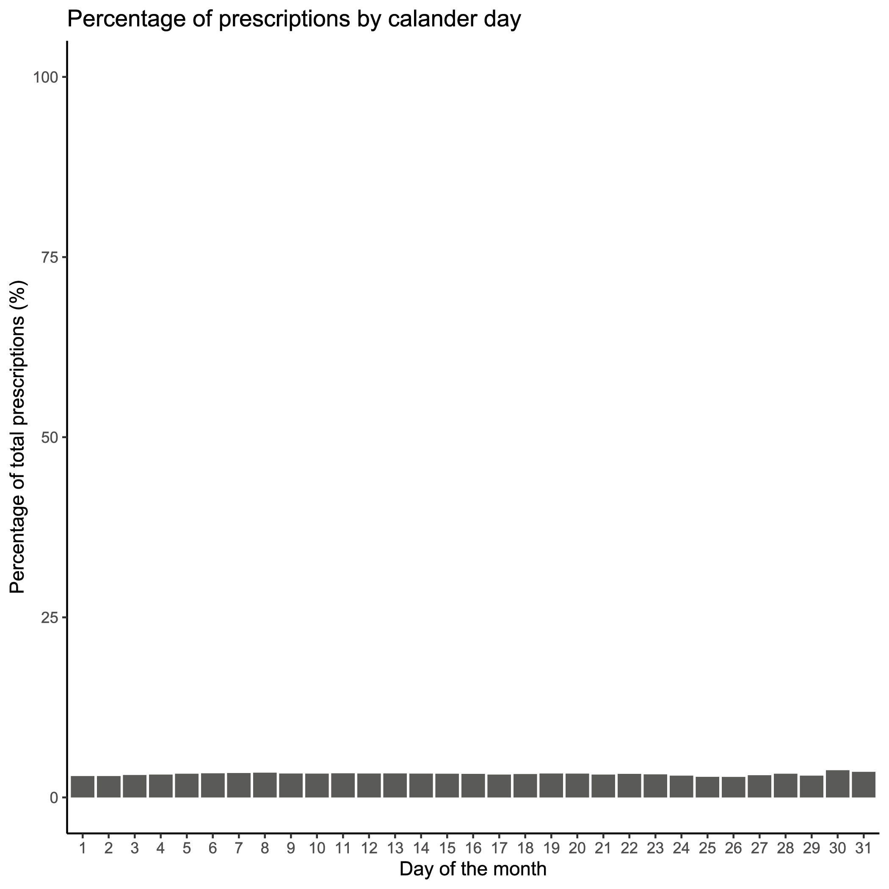
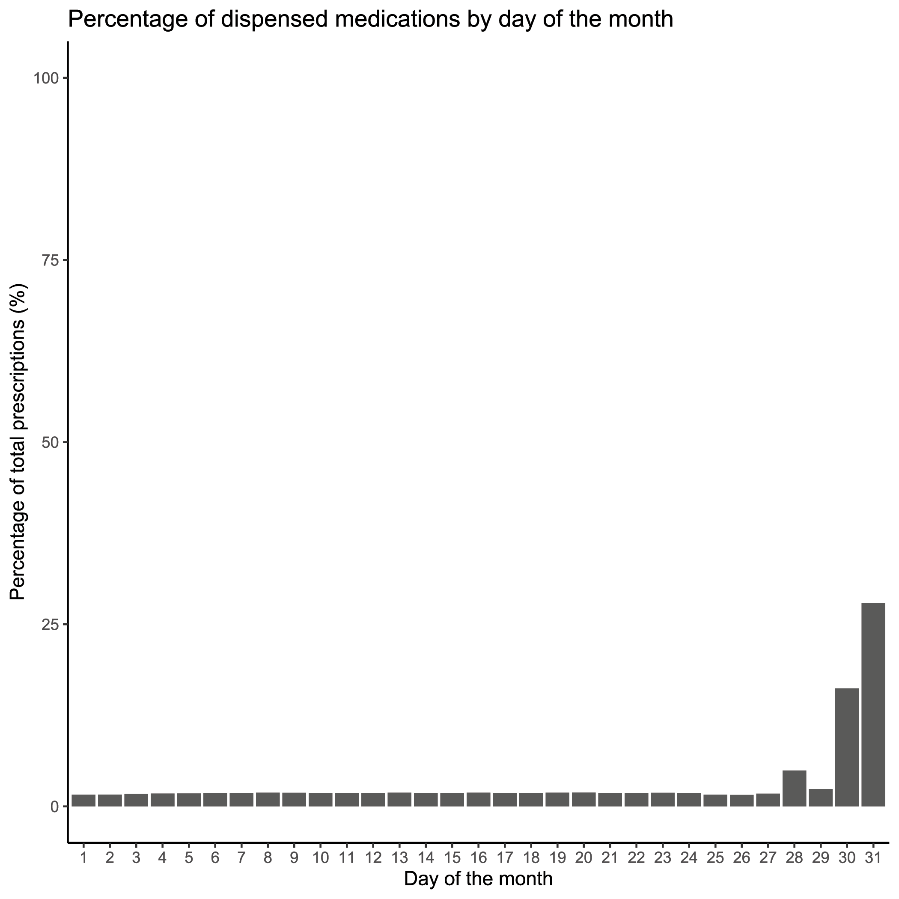

# Electronic Patient Records (EPR) Resources
A collection of resources, both papers and websites, that I've found useful when working with UK electronic patient records (EPR). 

Within a Scotland-specific context, NHS Scotland has a long tradition of linking and using health service data for research to improve patient outcomes, measure long-term outcomes in clinical trials, assess the safety of new medical interventions, and support understanding patterns in health and illness across whole populations. Within the context of Scottish NHS, Data Safe Havens form an integral part of Scotland's health informatics capabilities where it is not practicable to obtain individual patient consent for participation \citep{charterSH2015}. A Safe Haven is a secure research environment supported by trained staff and information governance processes where electronic patient records (EPR) can be linked with other data and made available in a de-identified form for analysis while protecting patient identity \citep{sh2012, charterSH2015, SH2023}. Safe Havens are structured such that the National Safe Haven contains information for all residents within Scotland, and four regional Safe Havens support it:
* Health Informatics Centre (HIC) - NHS Tayside with the University of Dundee
* DataLoch - NHS Lothian with the University of Edinburgh
* West of Scotland (WoS) Safe Haven - Greater Glasgow & Clyde Health Board with the University of Glasgow (recently formed from the Glasgow Safe Haven)
* Grampian Data Safe Haven (DaSH) - NHS Grampian and the University of Aberdeen

The regional Safe Havens work independently in full compliance with relevant codes of practice, legislation, and statutory orders in accordance with current professional practice. They are responsible for providing information about patients residing within their territories \citep{charterSH2015}. Together, these Safe Havens form a federated network to support research across Scotland. 

Useful link: WoS Safe Haven User Guide: https://www.nhsggc.org.uk/media/266674/glasgow-safe-haven-user-guide.pdf
  
<b>Dataset Classifications</b>
Whether it's the National Safe Haven or a regional Safe Haven, data sets available for linkage are classified into three tiers based on area coverage and data generation source. Tier 1 datasets are the most curated of the three tiers. The data are collated at a national level and contain information from everyday care, such as community-based prescriptions and hospitalisations \citep{Watson2020}. Following on, Tier 2 datasets are generated locally or regionally to help advance that location's services and to benefit their patients, such as programs to enhance general practice outcomes. Finally, Tier 3 datasets are generated by individual research projects conducted within the Safe Haven and are not currently available for request <a href="#Watson2020">(Watson 2020)</a>\citep{Watson2020}.

<b>Data Source Descriptions</b>

  The following is not an exhaustive list of available datasets but rather is intended to provide a list of the most commonly requested ones. 
  

<b><i>Demographics</i></b>

    Scotland has a long history of EPR captured from birth through death using individual Community Health Index (CHI) numbers. CHI numbers allow for the unique identification and tracking of patients across NHS Scotland's services \citep{NHSDigChi2022}. The CHI number is the Scottish equivalent to England and Wales's NHS number. CHI numbers are assigned to each patient upon first registration with the system \citep{NHSChind}. CHI numbers are ten digits long, with the first six digits taken from the date of birth in two-digit format (<tt>DDMMYY</tt>), two random digits, a sex-based digit (i.e., even for women and odd for men), and an arithmetical check digit \citep{NHSDigChi2022}. 
      
    The demographics data are collated from a collection of sources based on CHI numbers. The data made available within the dataset are acquired largely from National Records Scotland (NRS) and records available to the NHS Safe Haven team. Demographic data include obfuscated date of birth (DOB), sex, and Scottish Index of Multiple Deprivation (SIMD).
      
    <b>Date of Birth</b>
    The NHS Safe Haven team obfuscated the canonical DOB. In the <tt>YYYY-MM-DD</tt> date format, DOBs are uniformly obfuscated by setting the day part of the date to be the middle of the month while maintaining the month and year values. For example, a birthday of 1922-01-09 would be changed to 1922-01-15.
   
<b>Sex</b> The Demographics <tt>sex</tt> field was taken as the authoritative version for an individual's sex. 
  
<b>Scottish Index of Multiple Deprivation (SIMD)</b>
    Scottish Index of Multiple Deprivation (SIMD) is an area-based measurement of socioeconomic deprivation assigned to residents of Scotland based on where they live. Scottish residents' SIMD 2012 status was calculated by the Scottish Government using thirty-one indicators from seven different aspects of deprivation: income, employment, health, education, housing, geographic access, and crime. The indicators are combined using a weighted sum to create a single index, providing a relative ranking for each small geographic area in Scotland. Areas average about 800 individuals \citep{Executive2012}. It is important to note that SIMD can only measure an area’s level of deprivation, not an individual’s level. The absence of deprivation should not necessarily be correlated with affluence. The terms most deprived or least deprived were used to refer to the areas and not to the individuals living in those areas \citep{Executive2012}. Other year's indexes are also available. 
  
Useful link: https://www.gov.scot/collections/scottish-index-of-multiple-deprivation-2020/
  

[!NOTE] Ethnicity is not recorded in the demographics file, though it is recorded in multiple other datasets, including the Scottish Morbidity Records and Scottish Care Information (SCI) Diabetes. Each dataset has a different level of granularity (e.g., 'White' versus 'White - Scottish' or 'White - British').

  

    

<b><i>Deaths</i></b>

      The deaths file is a Tier 1 dataset containing combined records of death from the General Register Office, sourcing data primarily from NRS deaths, though others can be used. Each record contains information including date of death (DOD), location of death, the underlying cause of death (COD), and space for up to 10 contributing <tt>COD</tt>. Since 1 January 2000, CODs are coded in accordance with the International Classification of Disease, 10th revision (ICD-10) \citep{NRS_DeathsBackground} (see [Section ICD-10](#sec-icd10)).
        
      <b>Cause of death</b>
      The underlying COD was recorded under <tt>COD</tt>. Within Scotland and the UK, the underlying COD is defined according to the World Health Organization's (WHO) definition as either the disease or injury which initiated the series of events leading directly to death or the circumstances of the accident or violence which produced the fatal injury \citep{who2022death, NationalRecordsofScotlandCOD}. If the certifying medical personnel cannot choose a single underlying COD, NRS uses the internationally agreed mortality coding rules in the ICD-10 standard to select the underlying cause of death \citep{Calderwood2018CertOfDeath}. Additionally, up to ten contributory CODs may be recorded. These are listed in ascending order based on their location within the series of events leading to death, with the first recorded as <tt>COD0</tt> and the last recorded under <tt>COD9</tt>.
    

      

<b><i>General Practice Local Enhanced Services (GP LES)</i></b>

       
 [!NOTE] Ccogerage ended in 2018. 

 Local Enhanced Services (LES) for general practice surgeries (GPs) is a service for which general practice surgeries receive additional payments for demonstrating a high-quality service for specific conditions, including coronary heart disease, diabetes mellitus, stroke, chronic obstructive pulmonary disease, heart failure with reduced ejection fraction (but not heart failure with preserved ejection fraction), learning disabilities, and nationally enhanced services for drug misuse. Surgeries can subscribe to any number of the LES, without covering every service. The GPLES is a dataset which contains information about patients who received care under the LES scheme. Of note, coverage ended in 2018. 

Each GPLES record contains a <tt>safehavenID</tt>, the event date (<tt>EventDate</tt>), a Read code describing the entry (<tt>READCODE</tt>), a user-editable description to complement said code (<tt>Description</tt>), a flag for if the record pertains to a prescription (<tt>IsPrescription</tt>), a flag for if the record pertains to numerical values (<tt>IsValue</tt>), two value fields (<tt>Value1</tt> and <tt>Value2</tt>), the local enhanced service area (e.g., 3 for diabetes and 4 for congestive heart failure) (<tt>LESAreaID</tt>).
      

<b><i>Scottish Morbidity Records (SMR)</i></b>

Scottish Morbidity Records are Tier 1 datasets containing individual-level healthcare data for patients treated on the NHS within Scotland. The type of record denotes the general type of healthcare received and/or the patient's medical status.
  

SMR00 - Outpatient Appointments & Attendance

  [!NOTE] It is Recommended to avoid using diagnostic or procedural information from SMR00
    
  SMR00 contains information on outpatient appointments, attendance, and procedures performed. A record is generated when a patient either has outpatient clinical interaction or when the patient meets with a healthcare provider responsible for care outwith an outpatient clinic session \citep{SMR00nd}. The value of SMR00 lies in tracking patient contact with a specialist. Unfortunately, this rarely includes information on diagnosis or procedures.

SMR01 - General/Acute Inpatient & Day Case

SMR01 contains information regarding all general and acute inpatient and day cases from all NHS hospitals in Scotland. Each row of data corresponds to an episode of care. Patients receive a new episode of care each time they change specialty, significant facility <a href="#specialty">[1]</a>, or consultant for medical reasons.
     
Each episode of care contains some demographic information about the patient, admission, discharge, procedures if performed, and diagnostic factor(s) contributing to the episode. The demographic information contained within each row is limited to ethnicity, age, and Scottish Index of Multiple Deprivation (SIMD) decile and quintile. Admission information covers admission date (<tt>ADMDATE</tt>), admission type (i.e., emergency, urgent, or routine in <tt>ADMTYPE</tt>), where the patient was admitted or transferred from (<tt>ADMTRANS</tt>), what specialty the patient was treated by (<tt>SPEC</tt>), and what hospital the patient was admitted to (<tt>HOSP</tt>). Discharge information covers discharge date (<tt>DISDATE</tt>), discharge type (e.g., regular discharge, death, or transfer in <tt>DISTYPE</tt>), and where the patient was discharged or transferred to (<tt>DISTRANS</tt>). 
Each record must have the first diagnostic position (<tt>DIAG1</tt>) populated, which defines the primary diagnosis or main problem treated within the episode of care, and may have up to five additional positions populated with diagnosis information classified using ICD-10 codes (see [Section ICD-10](#sec-icd10)). Data quality assurance assessments have suggested coding accuracy levels $\geq$ 88% using the first 4 digits of the ICD-10 code for <tt>DIAG1</tt>, but accuracy declines for <tt>DIAG2</tt> - <tt>DIAG6</tt>, including under-reporting of common conditions such as heart failure and atrial fibrillation/flutter \citep{PHS2019, Khand2005, DataAccuractySMR012019}. However, coding may be more accurate for some conditions which have a large objective component to diagnosis (e.g., cancer, myocardial infarction), but much less accurate for those which have a large subjective component (e.g., heart failure), or where the problem is not considered a primary problem (e.g., atrial fibrillation \citep{Khand2005}.
   

Additionally, each record has space for up to four procedures (<tt>OPxA</tt> [where <tt>x</tt> is the procedure number 1 - 4]) with the potential for additional information (e.g., laterality, aborted, or unsuccessful are coded in <tt>OPxB</tt> [where <tt>x</tt> is the procedure number 1 - 4]) codes recorded using Office of Population Censuses and Surveys Classification of Interventions and Procedures, version 4 (OPCS-4) (see Section \ref{sec:opcs}). Where applicable, the procedure coded in <tt>OP1A</tt> is considered the primary or main procedure for that episode of care. As with diagnostic codes, duality assurance assessments have shown coding accuracy levels $\geq$ 94% using the first four digits of the OPCS-4 code, with $\geq$ 97% of hospitals reporting codes \citep{PHS2019}.  
  

[1] A division of medicine or density covering a specific area of clinical activity and identified within one of the Royal Colleges or Faculties.

Useful links:
* SMR01 crib sheet:https://publichealthscotland.scot/media/24925/smr01_crib_270323.pdf
* Explanation of data collection and validation: https://www.publichealthscotland.scot/publications/acute-hospital-activity-and-nhs-beds-information-quarterly/acute-hospital-activity-and-nhs-beds-information-quarterly-quarter-ending-31-december-2019/data-quality/
* WoS SMR01 Data Package explanation: https://www.nhsggc.org.uk/media/251274/13-smr01-data-package.pdf

SMR04 - Mental Health Inpatient & Day Cases

  SMR04 contains information regarding mental health inpatient and day cases. The SMR04 dataset has a similar format to that of SMR01 (see [Section SMR01]((#sec-smr01)) with regard to the information provided. Data points are recorded within episodes of care and contain patient demographics, admission, discharge, and diagnostic information. However, in most cases, patients will be transferred to general hospitals to undergo procedures and medical intervention, which would be recorded in SMR01. For this reason, patients are still at risk of experiencing an SMR01 admission while receiving care under the purview of an SMR04 contributing facility. SMR04 admissions tend to be for more extended stays than are found in SMR01 admissions.
    
  Useful links:
  SMR04 crib sheet: https://publichealthscotland.scot/media/24927/smr04_crib_270323.pdf

SMR06

 

  
  
<b><i>Prescribing Information System (PIS)</i></b>

  The Prescribing Information System (PIS) is a fairly unique resource that enables pharmaco-epidemiological research due to its population coverage and record linkage. PIS covers all NHS medications prescribed, dispensed and reimbursed in the community setting within Scotland \citep{Alvarez-Madrazo2016}. Prescriptions written in hospitals and dispensed in the community setting are also included in the dataset \citep{pis2022}. Of note is that the West of Scotland version of PIS only holds records of dispensed prescriptions. PIS uses the CHI number to link individuals prescribing and dispensing data to their other health records data since 2009, with a coverage that is almost 100% for prescribed and dispensed items \citep{Alvarez-Madrazo2016}. 
    
  For each reimbursed prescription, PIS provides the approved name, product name, formulation, and strength using the British National Formulary (BNF) chapter and item codes (see Section \ref{sec:bnf}). Importantly, PIS does not provide information on how often a medication should be taken, how many pills should be taken at one time, nor at what time of day. Additionally, records do not explicitly record the reasoning or timing of when treatment was started, changed, or terminated \citep{williams2016making}. 
    
  <b>Use of Prescribing and Dispensing Date</b>
  Each prescription record is accompanied by a prescribing date (<tt>PRESC_DATE</tt>), indicating when the medication was prescribed to the patient, and a dispensing date (<tt>DISP_DATE</tt>), when the patient acquired the medication. The PIS data has two known quirks involving the prescription and dispensing dates that need to be considered. Regarding the prescribing date, there were prescriptions for individual medications where the patient, medication, and prescribed date were the same, but each row had a different dispensed date. One would assume these are repeat prescriptions, but the pattern was rare before 2013. When this pattern isn't present, the prescribed date defaulted to the dispensed date for prescriptions after the initial prescription. That is, the prescribed date changed even if the prescription was repeated.
  
Concerning the dispensing date, recorded dates likely represent when the pharmacy was reimbursed for the prescription (typically the last day of the month) rather than the date when the medication was dispensed to the patient. This record pattern is shown below, where prescription dates are uniform throughout the month, while dispensing dates tend to fall on the last day of the month. This is likely an artefact due to Scotland's free at-the-point-of-contact prescriptions, where pharmacies are reimbursed monthly rather than on the day when the patient collects the medication. 

 

    

   
   
      
<em>Spread of recorded prescription days (<tt>PRESC_DATE</tt>) across the month versus spread of recorded dispensing days (<tt>DISP_DATE</tt>), a reimbursement artefact.</em>

  Useful link: 
* Describing paper: https://academic.oup.com/ije/article/45/3/714/2572798?login=true
  

  

  
<b><i>Scottish Care Information - Diabetes Collaboration (SCI-Diabetes)</i></b>

    Scottish Care Information - Diabetes Collaboration (SCI-Diabetes) is a Tier 1 dataset holding the electronic clinical registry records pertaining to the treatment of people with diabetes mellitus in Scotland \citep{Livingstone2012}. It holds some records dating back to the mid-1920s, but full coverage with automatic capture based on assigned Read Code started in 2000. It has a national estimated capture of $\geq$ 99% of all people diagnosed with diabetes mellitus \citep{Livingstone2012}. 
      
    
  Useful link: 
* Describing paper: https://journals.plos.org/plosmedicine/article?id=10.1371/journal.pmed.1001321

 

  
<b><i>Scottish Care Information Store (SCI Store)</i></b>

Scottish Care Information Store (SCI Store) is a Tier 2 dataset covering the Scottish NHS Health Boards and contains clinical reports from biochemistry, haematology, pathology, microbiology, and radiology \citep{SciStoreAbout2015}. The most common SCI Store linkage provided is to extract information on haematology and biochemistry test values. When using haematology and biochemistry, it is recommended to select test types using the <tt>CLINICALCODEVALUE</tt> field to capture routine tests, rather than tests taken for niche reasons.  
     
   
 Useful link: WoS data package description: https://www.nhsggc.org.uk/media/251273/07-scistore-data-package.pdf

   [!NOTE] Failed runs and impossible values are included.  Make sure to remove biologically implausible test results. 

<b>Serum Creatinine and Estimated Glomerular Filtration Rate</b>
       Creatinine is a waste product from muscle tissue. Normal serum levels are based predominantly on an individual's age and sex; high levels indicate impaired renal function. Serum Creatinine values were identified using the <tt>CLINICALCODEVALUE</tt> `44J3.'. It is commonly used to estimate renal function as the main component in calculating the estimated glomerular filtration rate (eGFR). It is recommended to calculate the eGFR values directly from the serum creatinine rather than using the recorded eGFR values, as these recorded values are capped at 60 ml/min/1.73m2 when values surpass this, and not all recorded serum creatinine values have mapped eGFR value.  To calculate eGFR, one must assume that the serum creatinine values were standardised using isotope dilution mass spectrometry. 
 

<b>Data classification</b>

<b><i>International Classification of Diseases, 10th revision (ICD-10)</i></b>

  The International Classification of Disease (ICD) was originally a system to classify causes of death but has since expanded its scope to include non-fatal diseases, medical procedures, impairments, disabilities and handicaps \citep{whoicd2016}. The 10\textsuperscript{th} revision was adopted by the WHO in May 1990 and went into effect on 1 January 1993 \citep{WhoICD2022}. More formally, the International Statistical Classification of Diseases and Related Health Problems, 10th Revision (ICD-10) coding standard is a hierarchical standard provided by the WHO to enable systematic health recording and collection of statistics on disease in primary, secondary, tertiary care, and death certificates internationally and over time \citep{WhoICD2022}. The codes translate potentially complicated medical diagnoses and other health problems into a finite set of alphanumeric codes, permitting easy storage and analysis \citep{whoicd2016}. 
  
 Internationally, many countries have developed country-specific modifications to the WHO's version of the ICD-10 codes \citep{Jette2010}. Universally, codes are at least three characters long, and the maximum can vary \citep{whoicd2016, Jette2010}. Within the UK, ICD-10 codes range between 4 and 6 characters long. The first character is a letter, following international standards, and the second two characters are always numbers, then a period followed by an alphanumeric character \citep{generalICD}. In the case of a 3-character code, the UK fills in the fourth character with an 'x' \citep{NhsDigitalIcd2022}. If present, the sixth character is the dagger 'D' or asterisk 'A' indicator, though these can be present in the fifth position, where there are either modified 3-character or standard 4-character codes \citep{codeFormats}. 
      
  
Useful links: 
* Classification browser ICD-10: https://icd.who.int/browse10/2016/en
* Code list generation: https://www.opencodelists.org/
  

<b><i>Office of Population Censuses and Surveys Classification of Interventions and Procedures, version 4 (OPCS-4)</i></b>

  The Office of Population Censuses and Surveys Classification of Interventions and Procedures, version 4 (OPCS-4) coding standard is developed, maintained, licensed, and supported by NHS Digital's Terminology and Classifications Delivery Service and governed by Crown Copyright \citep{opcsNHSDigital2019}. OPCS-4 is a hierarchical coding standard used to classify operations, procedures, and interventions conducted within the NHS. OPCS-4 codes are four characters long and have a similar structure to ICD-10 codes. OPCS-4 codes start with a letter followed by three digits. A full stop (.) separates the second and third digit \citep{opcs2021}. 
    
  
Useful link: Classification browser OPCS-4.10: https://classbrowser.nhs.uk/#/book/OPCS-4.10
  

<b><i>Read Codes</i></b>

Read Codes are a hierarchical controlled clinical vocabulary for terms and short phrases \citep{Robinson1997, Pringle1990, Chisholm1990}. The first widely used version of Read Codes was standardised to 4-byte set codes, which was then extended to a 5-byte unified set. Version 2 added a term code to hold an <tt>idea</tt> or <tt>concept</tt>, where the preferred term appends '00' and additional synonyms append term codes 11-99 \citep{Booth1994}. For example, if the original 5-byte Read Code was 'G30..' for acute myocardial infarction, the 5-byte version 2 code, with the preferred term code, is 'G30..00' for 'Acute myocardial infarction' and the first synonym, 'Attack - heart' for heart attack, is 'G30..11', followed by 'Coronary thrombosis', 'G30..12'. 
The WoS's GP LES dataset uses the 5-byte set of codes without the term code, which means synonyms are mapped onto the same five-digit code. For example, 'G580.00', 'Congestive heart failure', and 'G580.11', 'Congestive cardiac failure' both map onto 'G580.'. Additionally, trailing space holders (.) have been removed due to formatting errors or deliberate elimination. This means 'G580.11' maps to 'G580' and 'G58..00', and 'heart failure' maps to 'G58'. 
    

  Useful links: 
  * Code lists (published but use with care): https://clinicalcodes.rss.mhs.man.ac.uk/
  * HDRUK Phenotye Library (published but use with care): https://phenotypes.healthdatagateway.org/

<b><i>British National Formulary (BNF)</i></b>

The first nine characters of the BNF code specify the chemical level of the medication. Within these nine characters, the first two characters indicate the chapter of the BNF that the medication is from. For example, drugs in BNF Chapter 2 (Cardiovascular System) will always begin with '02'. The code is then further subdivided into sections (e.g., Diuretics, contained within Chapter 2 Section 2 of the BNF, all begin with '0202'). The remaining six characters provide more detailed information about the medication, including whether the product is branded or generic, its strength, and its formulation (see below for a breakdown of a 9-character BNF code).
  

  
  
  <em>A breakdown of the BNF code for a generic 40 mg tablet of furosemide. 'AA' in the 'Product' section always indicates that the medication is a generic version. The asterisk indicates that any code could be entered in this section.</em>

  
<b>Classifying Prescriptions</b>
There are two primary ways to classify prescriptions. The first, and most straightforward way, is to classify prescriptions using the BNF Chapter, Section, or Paragraph. The benefit of this classification mechanism is that it easily groups medications without incorporating potential selection bias or classification errors. However, combination medications are often in a separate paragraph from the constituent chemicals. 
  

The alternative is to classify medications based on their active chemicals, meaning that loop diuretics would include all medications which included a member of the loop diuretic family:
  

|BNF Code  | Description |
| ------------- | ------------- |
| 020202 | Loop diuretics (the Paragraph) |
| 0202040D0 | Amiloride HCI with loop diuretics |
| 0202040B0 | Co-amilofruse (Amiloride hydrochloride/frusemide) |
| 0202040T0 | Spironolactone with loop diuretics | 
| 0202040U0 | Triamterene with loop diuretics | 
| 0202080D0 | Bumetanide/Amiloride hydrochloride |
| 0202080C0 | Bumetanide/potassium | 
| 0202080K0 | Furosemide/potassium |

  

Useful links: 
* Open Prescribing: https://openprescribing.net/bnf/
* Code list generation: https://www.opencodelists.org/
* BNF code descriptions: https://www.bennett.ox.ac.uk/blog/2017/04/prescribing-data-bnf-codes/#:~:text=The%20BNF%20codes%20from%20this,BNF%20a%20drug%20is%20from.

  

<b>References</b>

The contents of this page have been adapted and extended from my PhD thesis: 
Friday, J. M. 2023. The pharmaco-epidemiology of loop diuretic dispensing and its relationship to the diagnosis of heart failure and to prognosis. PhD, University of Glasgow. 

 Watson, S. (2020), ‘Safe Haven’. URL: https://www.quest.scot.nhs.uk/hc/en-gb/articles/115005312709-Safe-Haven

